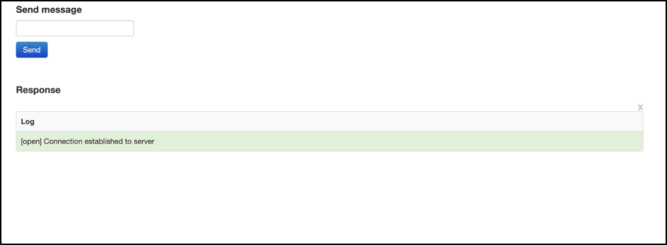
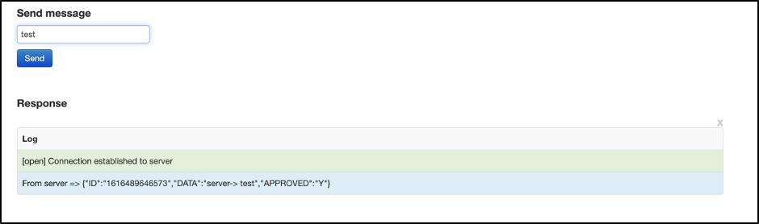

# confluent-websockets

Clone the github repo. Once done, navigate to the websockets folders and run “./scripts/run.sh” 
This will start the required components (please make sure that you have docker and docker-compose installed in your system)

Once everything is running you should see the following line in the console -
"open index.html page (under ‘client’ folder) in a browser...."

Open the index. html file in a browser. You should see a screen similar to this -

Enter any message in the text box and press “send”. You should get back a JSON response as indicated in the “Log” section -

